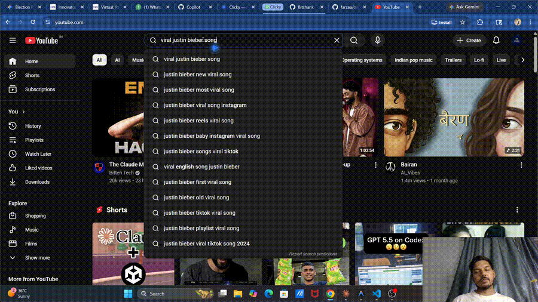

# Kai Agent for Windows 🔵

> **An AI teaching companion that lives next to your cursor.**
> Ask it anything about your screen — it points, explains, and guides you step-by-step, like a real tutor sitting beside you.

Kai Agent is a Windows port of [farzaa/kai-agent](https://github.com/farzaa/kai-agent) (originally macOS/SwiftUI). Built with **Python 3.11+ and PyQt6**, runs fully in the background, works with every major AI provider.

---

## Hi, this is Kai Agent 👋

[](https://youtu.be/WYY9yJHDaEU)

> 🎬 **[Watch full demo on YouTube →](https://youtu.be/WYY9yJHDaEU)**

Kai Agent is a little AI buddy that **lives next to your cursor**. You hold a hotkey, ask it something about your screen, and it talks back — pointing at buttons, walking you through steps, drawing arrows on your screen. Think of it as having a patient tutor sitting beside you while you learn anything: video editing, coding, a new app, whatever.

No more Alt-Tab to ChatGPT. No more typing out descriptions of what's on your screen. Just hold **Ctrl + Alt + Space**, speak, and Kai Agent handles the rest.

Works **100% offline** with Ollama, or plug in your Claude / OpenAI / Gemini / GitHub Copilot key for the full experience.

---

## What it looks like

```
┌─────────────────────────────────────────────┐
│  Your screen (browser, IDE, Premiere, etc.) │
│                                             │
│          🔵◂  ← Kai Agent blue buddy           │
│          (floats beside your real cursor)   │
│                                             │
│  ┌──────────────────────────┐               │
│  │  Kai Agent  [Claude]    —   │  ← panel      │
│  │  ● Thinking…             │               │
│  │  "The search bar is      │               │
│  │   right here ↗"          │               │
│  │  Model: claude-sonnet-4… │               │
│  └──────────────────────────┘               │
└─────────────────────────────────────────────┘
```

The blue triangle sits **35 px right / 25 px below** your real cursor. When you ask it to point at something it **flies** to that element via a smooth bezier arc (teacher pace), dwells with a pulsing highlight ring, then flies back.

---

## Feature List

### 🎙️ Voice Activation
- Hold **Ctrl + Alt + Space** to push-to-talk
- Say **"Kai Agent"** for hands-free wake word
- Press **Esc** to stop any response or TTS mid-stream

### 👁️ Screen Aware
- Full multi-monitor screenshot on every query
- Describes only what it sees — never hallucinates
- Detects active window title for per-app memory

### 🎯 Pixel-Perfect Pointing
- **Two-stage grid locator** works with *any* vision LLM — Claude, Copilot, OpenAI, Gemini, Ollama
- Stage 1: draws a numbered 12×8 grid on the screenshot, LLM picks the cell
- Stage 2: zooms into that 3×3 cell area, runs a 6×6 fine-grid pass for sub-cell precision
- Bezier arc flight with configurable teacher pace
- Pulsing highlight ring + speech bubble label on the target
- Works on any DPI scale (4K, HiDPI, multi-monitor setups)

### 🧑‍🏫 Real Tutor Behaviour
- **Locate queries** → points + 1-sentence explanation (no generic text directions)
- **Multi-step tasks** → breaks into steps, says "Say 'next' when ready"
- **"Next"** / **"Continue"** → advances lesson without a new LLM call
- **"Repeat"** → replays the last answer via TTS without re-querying
- **"Stop"** / **"Cancel"** → cancels generation instantly

### 🌐 Web Search (Real-Time Data)
- DuckDuckGo HTML scrape + concurrent page fetch — **no API key needed**
- Optional Tavily upgrade for deeper results
- Responses grounded in today's data with `[1]`, `[2]` citations
- Always knows today's date — never gives stale answers

### 🔄 Multi-Provider LLM (Runtime Switching)
| Provider | How to unlock |
|---|---|
| **Claude** (Anthropic) | `ANTHROPIC_API_KEY` in `.env` |
| **OpenAI GPT-4o** | `OPENAI_API_KEY` in `.env` |
| **GitHub Copilot** | Free for students — device-flow login via tray |
| **Gemini** | `GOOGLE_API_KEY` in `.env` |
| **Ollama** (local) | Run `ollama serve` — free, always available |

Priority chain (auto-detected): **Claude → OpenAI → Copilot → Gemini → Ollama**

Switch mid-session from the system tray — takes ~1 second, no restart.

### 📋 Live Model Lists (Auto-Refreshed)
- Claude, OpenAI, Gemini: live model list fetched from vendor APIs, **30-day cache**
- GitHub Copilot: live `/models` endpoint with billing multiplier, **6-hour cache**
- Free Copilot models auto-prioritised (no premium quota burned by default)
- Panel model dropdown always reflects the actual available models for your account

### 🔊 Multi-Provider TTS
| Provider | Quality | Key needed |
|---|---|---|
| **ElevenLabs** | Premium voice clone | `ELEVENLABS_API_KEY` |
| **OpenAI TTS** | High quality | `OPENAI_API_KEY` |
| **Edge TTS** | Free, 400+ voices | None |

### 🗣️ Multi-Provider STT
| Provider | Speed | Key needed |
|---|---|---|
| **Deepgram** | Fast, accurate | `DEEPGRAM_API_KEY` |
| **OpenAI Whisper** | Very accurate | `OPENAI_API_KEY` |
| **whisper.cpp** | 3-5× faster local (Handy engine) | None (`pip install pywhispercpp`) |
| **Faster-Whisper** | Local, free fallback | None |

### 🧠 Per-App Memory
- Separate conversation history per active application
- Context never bleeds between Premiere, VS Code, Chrome, etc.
- History cap: last 20 messages per app

### 📝 Knowledge Journal + Spaced Repetition
- Every Q&A automatically logged to a local SQLite database
- Ask **"what did we cover today?"** → summary of today's session
- Ask **"what did we cover this week?"** → weekly digest
- **SM-2 spaced repetition** — Kai Agent reminds you to review topics at optimal intervals (1 → 3 → 7 → 14 → 30 → 60 → 120 days)
- Say **"quiz me on what I should review"** → flashcard session from your journal
- Journal stored at `%LOCALAPPDATA%\Kai Agent\journal.db`

### 📄 Document Context (Drag & Drop)
- Drag a **PDF, DOCX, TXT, MD, CSV, or code file** onto the Kai Agent panel
- Kai Agent reads it and uses it as context for your next questions
- Or use: **Tray → Journal → Attach document…** for a file picker
- Supports multi-file: attach several docs and ask cross-document questions

### 🔍 OCR Fallback (Fine Print)
- When query mentions "fine print", "small text", "read that", etc., Kai Agent runs **Tesseract OCR** on the screenshot
- Extracts text that's too small or low-contrast for the LLM's vision to read
- Requires: Tesseract binary from [UB-Mannheim/tesseract](https://github.com/UB-Mannheim/tesseract/wiki)
- Gracefully skipped if Tesseract isn't installed

### 💻 Code Mode (Auto-Detect)
- Detects VS Code, Cursor, IntelliJ, PyCharm, Vim, Neovim, Sublime, etc. by window title
- Automatically injects a **code-specialist system prompt addendum**: prefer code blocks, include language tags, explain algorithms step by step
- Toggle: **Tray → Tutor Mode → Code Mode (auto)**

### 🎓 Tutor Modes (Tray → Tutor Mode)
| Toggle | What it does |
|---|---|
| **Slow Mode** | 1.7× slower bezier flight + longer dwell — students can follow the pointer |
| **Quiz Mode** | Kai Agent asks YOU questions instead of answering; evaluates in one sentence |
| **Privacy Guard** | Skips screenshot when password manager / banking window detected |
| **Code Mode (auto)** | Code-specialist prompt when IDE is active |
| **Multilingual** | Auto-detects language, responds in kind, switches TTS voice |
| **OCR Fallback** | Runs Tesseract on screenshots when fine text is mentioned |

### 🌍 Multilingual Auto-Detect
- Detects query language via `langdetect` + Unicode script heuristics
- Responds in the same language automatically
- Switches Edge TTS voice to match (Hindi → HiRA-Neha, French → fr-FR-DeniseNeural, etc.)
- 15+ languages supported: EN, HI, FR, DE, ES, PT, AR, ZH, JA, KO, RU, IT, NL, PL, TR
- Toggle: **Tray → Tutor Mode → Multilingual**

### 🎬 Lesson Recording (MP4 + Transcript)
- Records screen at 8 fps as an MP4 alongside a Markdown transcript of all Q&A
- Start: **Tray → Lesson Recording → Start recording**
- Stop: tray menu → produces `lesson_YYYY-MM-DD_HH-MM.mp4` + `lesson_YYYY-MM-DD_HH-MM_transcript.md`
- Saved to `%LOCALAPPDATA%\Kai Agent\recordings\`

### 🖊️ Whiteboard Annotations
- Kai Agent can draw directly on your screen as it explains:
  - `[ARROW:x1,y1->x2,y2]` — animated arrow between two points
  - `[CIRCLE:x,y,r:label]` — pulsing circle with optional label
  - `[UNDERLINE:x,y,w]` — underline beneath text
  - `[LABEL:x,y:text]` — floating text label
- Annotations fade out after ~4 seconds automatically
- Cleared automatically on the next query

### 🖱️ Workflow Capture
- Records your mouse clicks and keyboard strokes while you work
- Start: **Tray → Workflow Capture → Start capturing my clicks**
- Stop: **Tray → Workflow Capture → Stop + send to Kai Agent**
- Ask: **"What did I just do?"** → Kai Agent narrates your workflow step-by-step
- Requires `pynput` (included in requirements.txt)

### 🎤 Voice Picker
- Switch TTS voice mid-session: say **"change voice to [voice name]"**
- Edge TTS voices: `AvaNeural`, `JennyNeural`, `GuyNeural`, `AriaNeural`, etc.
- Use `python -c "from audio.tts.edge_tts_provider import EdgeTTSProvider; print(EdgeTTSProvider.list_voices_sync())"` to list all 400+ voices

### 🔒 Privacy Guard (on by default)
Detects sensitive windows and skips the screenshot entirely:
- Password managers: KeePass, Bitwarden, 1Password, LastPass, Authenticator
- Sensitive pages: `login`, `sign in`, `banking`, `.env` files, `credit card`

### 🛠️ Skills System (User-Extensible)
Create your own voice triggers — no pull request needed:

```python
# ~/.kai_agent/skills/my_skill.py
import asyncio

SKILL = {
    "name": "open_calculator",
    "trigger": r"(open|launch|start) calculator",
    "description": "Opens Windows Calculator",
    "handler": open_calc,
}

async def open_calc(transcript: str, manager) -> str:
    import subprocess
    subprocess.Popen("calc.exe")
    return "Opening calculator for you."
```

Place skill files in `~/.kai_agent/skills/` — Kai Agent auto-loads on startup.

---

## Installation

### Prerequisites
- Windows 10 / 11 (64-bit)
- Python 3.11, 3.12, or 3.14
- A working microphone

### 1. Clone
```bash
git clone https://github.com/Bitshank-2338/kai-agent.git
cd kai-agent
```

### 2. Install dependencies
```bash
pip install -r requirements.txt
```

### 3. Configure API keys
Create `.env` in the project root (copy from `.env.example`):

```env
# ── LLM (add whichever you have — at least one required) ──
ANTHROPIC_API_KEY=sk-ant-...
OPENAI_API_KEY=sk-...
GOOGLE_API_KEY=AIza...

# ── STT (all optional — falls back to Faster-Whisper) ─────
DEEPGRAM_API_KEY=...

# ── TTS (all optional — falls back to Edge TTS) ───────────
ELEVENLABS_API_KEY=...
ELEVENLABS_VOICE_ID=...

# ── Web Search (optional — falls back to DuckDuckGo) ──────
TAVILY_API_KEY=...

# ── Ollama (local AI) ─────────────────────────────────────
OLLAMA_HOST=http://localhost:11434
OLLAMA_MODEL=llama3.2-vision

# ── Customise ─────────────────────────────────────────────
CLICKY_HOTKEY=ctrl+alt+space
WHISPERCPP_MODEL=base.en
```

### 4. GitHub Copilot (free for students)
```
Tray → Model → Sign in to GitHub Copilot…
→ visit github.com/login/device → enter code shown in terminal
```

Token cached at `%LOCALAPPDATA%\Kai Agent\github_token.json`. Default model = `gpt-4o-mini` (free tier).

### 5. Run
```bash
python main.py
```

A blue dot appears in your system tray. Kai Agent is now running.

---

## Zero-Cost Setup (100% Free)

No API keys at all — uses local AI, local STT, free TTS:

```env
OLLAMA_VISION_MODEL=qwen2-vl:7b
OLLAMA_TEXT_MODEL=qwen2.5-coder:7b
```

1. Install [Ollama](https://ollama.ai) → run `ollama serve`
2. Pull models: `ollama pull qwen2-vl:7b && ollama pull qwen2.5-coder:7b`
3. `pip install -r requirements.txt`
4. `python main.py`

Kai Agent uses **two Ollama model slots**: a vision model for screen-aware questions (pointing, "what's on screen?") and a text model for Code Mode / journal Q&A. Switch between them at any time from the tray: **Tray → Ollama → Vision model / Text model**.

**Recommended free models (Tray → Ollama → Pull recommended…):**

| Slot | Model | Size | Good for |
|---|---|---|---|
| Vision | `qwen2-vl:7b` | 5 GB | Screen reading, pointing — best quality |
| Vision | `llama3.2-vision:11b` | 8 GB | Alternative vision model |
| Vision | `llava:7b` | 4 GB | Fastest option |
| Text | `qwen2.5-coder:7b` | 4 GB | Code questions — excellent |
| Text | `llama3.2:3b` | 2 GB | Tiny, fits any GPU |
| Text | `mistral:7b` | 4 GB | General Q&A |

**Limitations vs paid:** Slower responses, web search uses DuckDuckGo only.

---

## Distribution — Single .exe Installer

For sharing with friends without Python:

```bash
# 1. Generate icon
python assets/make_icon.py

# 2. Build
pip install pyinstaller
pyinstaller kai_agent.spec --clean --noconfirm

# 3. Distribute
# → dist/Kai Agent/  (entire folder)
# → or build Setup.exe with Inno Setup using installer.iss
```

The `dist/Kai Agent/Kai Agent.exe` runs on any Windows machine without Python. Include a `.env` file next to the exe with your API keys, or set them as system environment variables.

See [BUILD.md](BUILD.md) for full packaging instructions including Inno Setup installer.

---

## Usage

### Voice Commands
| Say | Action |
|---|---|
| *"Where is the search bar?"* | Points at it + 1-sentence explanation |
| *"How do I export this video?"* | Step-by-step lesson mode |
| *"What's on screen?"* | Screen description |
| *"Search for [topic]"* | Web search + cited answer |
| *"next"* / *"continue"* | Advance to next lesson step |
| *"repeat"* | Replay last answer via TTS |
| *"stop"* / *"cancel"* | End current lesson |
| *"quiz me"* | Quiz mode on current screen |
| *"what did we cover today?"* | Today's journal summary |
| *"what should I review?"* | Spaced repetition flashcards |
| *"what did I just do?"* | Workflow capture narration |
| *"change voice to Jenny"* | Switch TTS voice |

### Keyboard
| Key | Action |
|---|---|
| `Ctrl + Alt + Space` (hold) | Push-to-talk |
| `Esc` | Stop response / TTS immediately |

### Tray Menu
Right-click the tray icon → full menu including:
- Provider switcher (Claude / OpenAI / Copilot / Gemini / Ollama)
- Tutor Mode submenus
- Lesson Recording controls
- Workflow Capture controls
- Journal (view folder, attach doc)
- Show/Hide Panel

---

## Architecture

```
main.py
  ├── CompanionManager          # async state machine + orchestrator
  │     ├── AmbientListener     # always-on mic + wake-word
  │     ├── STT provider        # Deepgram / OpenAI Whisper / whisper.cpp / Faster-Whisper
  │     ├── screen.capture      # multi-monitor JPEG (physical px + DPI metadata)
  │     ├── tutor.py            # classifiers, privacy guard, window detection
  │     ├── tutor_features/
  │     │     ├── journal.py        # SQLite Q&A log + SM-2 spaced repetition
  │     │     ├── pdf_context.py    # PDF/DOCX/TXT text extraction
  │     │     ├── ocr.py            # Tesseract OCR fallback
  │     │     ├── code_mode.py      # IDE detection + code prompt addendum
  │     │     ├── lesson_recorder.py # MP4 + transcript recording
  │     │     ├── multilang.py      # langdetect + Edge TTS voice switching
  │     │     ├── workflow_capture.py # pynput click/key recorder
  │     │     └── collab.py         # live session skeleton (WebRTC)
  │     ├── skills/             # user-extensible voice triggers
  │     ├── ai.web_search       # DuckDuckGo + Tavily + citation builder
  │     ├── ai.element_locator  # Claude Computer Use → exact (x, y) pixel
  │     ├── ai.model_registry   # live model lists with 30-day cache
  │     ├── LLM provider        # Claude / OpenAI / Copilot / Gemini / Ollama
  │     └── TTS provider        # ElevenLabs / OpenAI / Edge TTS
  ├── CursorOverlay             # transparent click-through Qt window
  │     ├── Blue triangle buddy (spring-follows cursor)
  │     ├── Bezier arc flight   (teacher-pace pointing)
  │     ├── Highlight ring      (pulsing circle on detected element)
  │     ├── Speech bubble       (label while dwelling)
  │     ├── Whiteboard annotations (arrows, circles, underlines, labels)
  │     ├── Waveform bars       (listening state)
  │     └── Spinner arc         (thinking state)
  ├── CompanionPanel            # optional chat panel with model dropdown
  └── TrayManager               # system tray + full context menu
```

### Coordinate Pipeline (Pixel-Perfect Pointing)
```
Screenshot → JPEG (1280px max, for LLM tokens)
                │
                â–¼
Claude Computer Use analyses screenshot
→ returns (x, y) in Computer-Use space (1280px wide)
                │
                â–¼
element_locator.py converts:
  CU space → physical monitor pixels
           → + monitor origin (multi-monitor offset)
           → ÷ DPI scale (HiDPI correction)
           = logical screen pixels
                │
                â–¼
overlay.point_at(logical_x, logical_y)  ← correct position on any screen
```

---

## File Structure

```
kai-agent/
├── main.py                      # entry point — boots Qt, wires all signals
├── companion_manager.py         # async orchestrator + state machine
├── config.py                    # env loading, provider detection, priority chain
├── tutor.py                     # classifiers, privacy guard, prompt builder
├── hotkey.py                    # global hotkey + Esc stop
│
├── ai/
│   ├── base_provider.py         # BaseLLMProvider ABC
│   ├── claude_provider.py       # Anthropic Claude
│   ├── openai_provider.py       # OpenAI GPT-4o
│   ├── gemini_provider.py       # Google Gemini (via httpx)
│   ├── ollama_provider.py       # Local Ollama
│   ├── github_copilot_provider.py  # Copilot OAuth + live /models
│   ├── element_locator.py       # Computer Use → pixel coords
│   ├── model_registry.py        # live model lists, 30-day cache
│   └── web_search.py            # DuckDuckGo + Tavily + citations
│
├── audio/
│   ├── ambient_listener.py      # always-on mic + wake-word
│   ├── capture.py               # PCM capture
│   ├── playback.py              # cancellable audio (threading.Event)
│   ├── stt/
│   │   ├── faster_whisper_stt.py
│   │   ├── whisper_cpp_stt.py   # pywhispercpp (optional, 3-5× faster)
│   │   ├── openai_stt.py
│   │   └── deepgram_stt.py
│   └── tts/
│       ├── edge_tts_provider.py
│       ├── openai_tts_provider.py
│       └── elevenlabs_provider.py
│
├── screen/
│   └── capture.py               # multi-monitor JPEG + DPI metadata
│
├── tutor_features/
│   ├── journal.py               # SQLite Q&A log + SM-2 spaced repetition
│   ├── pdf_context.py           # PDF/DOCX/TXT extraction
│   ├── ocr.py                   # Tesseract OCR fallback
│   ├── code_mode.py             # IDE detection + code prompt addendum
│   ├── lesson_recorder.py       # MP4 + transcript
│   ├── multilang.py             # language detection + voice switching
│   ├── workflow_capture.py      # click/keystroke recorder
│   └── collab.py                # live session skeleton
│
├── skills/
│   ├── __init__.py              # skill loader + trigger matcher
│   └── example_self_mode.py     # example skill
│
├── ui/
│   ├── overlay.py               # CursorOverlay — all drawing + annotations
│   ├── panel.py                 # CompanionPanel — chat + model dropdown
│   ├── tray.py                  # TrayManager — tray icon + full menu
│   └── design.py                # shared colours, fonts, constants
│
├── assets/
│   ├── make_icon.py             # generates icon.ico
│   └── icon.ico                 # (generated)
│
├── .env                         # your API keys (not committed)
├── requirements.txt             # all Python dependencies
├── kai_agent.spec                  # PyInstaller build spec
├── installer.iss                # Inno Setup installer script
├── build.bat                    # one-click build script
├── BUILD.md                     # full build + packaging guide
└── LICENSE                      # MIT
```

---

## Configuration Reference

| Variable | Default | Description |
|---|---|---|
| `ANTHROPIC_API_KEY` | — | Claude LLM + Computer Use pointing |
| `OPENAI_API_KEY` | — | GPT-4o LLM + Whisper STT + OpenAI TTS |
| `GOOGLE_API_KEY` | — | Gemini LLM |
| `DEEPGRAM_API_KEY` | — | Deepgram STT |
| `ELEVENLABS_API_KEY` | — | ElevenLabs TTS |
| `ELEVENLABS_VOICE_ID` | — | Your ElevenLabs voice clone ID |
| `TAVILY_API_KEY` | — | Tavily search (upgrades DuckDuckGo) |
| `OLLAMA_HOST` | `http://localhost:11434` | Ollama server URL |
| `OLLAMA_MODEL` | `llama3.2-vision` | Legacy single-model fallback |
| `OLLAMA_VISION_MODEL` | *(empty)* | Ollama model for screen-aware tasks (pointing, describe screen) |
| `OLLAMA_TEXT_MODEL` | *(empty)* | Ollama model for Code Mode + journal Q&A |
| `CLICKY_HOTKEY` | `ctrl+alt+space` | Global push-to-talk combo |
| `CLICKY_STT` | *(auto)* | Force STT: `deepgram`/`openai`/`whisper_cpp`/`faster_whisper` |
| `CLICKY_ACTIVE_LLM` | *(auto)* | Force LLM: `claude`/`openai`/`copilot`/`gemini`/`ollama` |
| `WHISPER_MODEL` | `base` | Faster-Whisper model (`tiny`/`base`/`small`/`medium`) |
| `WHISPERCPP_MODEL` | `base.en` | whisper.cpp model size |

---

## Troubleshooting

**Kai Agent doesn't hear me**
→ Check default microphone in Windows Sound settings
→ Upgrade to Deepgram for better accuracy in noisy rooms

**"Thinking…" forever with Ollama**
→ Run `ollama serve` in a terminal first
→ Run `ollama pull llama3.2-vision` to download the model
→ Press Esc to cancel

**Pointing at wrong location**
→ Make sure your active LLM supports vision (Copilot gpt-4o, Claude, Gemini 1.5+, or a vision Ollama model)
→ For Ollama: set a vision model via **Tray → Ollama → Vision model**
→ The universal two-stage grid locator works with every vision provider — no Anthropic key required

**GitHub Copilot auth fails**
→ Re-run: Tray → Model → Sign in to GitHub Copilot…
→ Check `%LOCALAPPDATA%\Kai Agent\github_token.json` exists

**Esc doesn't stop audio**
→ Make sure `sounddevice` is installed (`pip install sounddevice`)
→ Check that no other app has exclusive access to the audio device

**OCR returns nothing**
→ Install Tesseract binary from https://github.com/UB-Mannheim/tesseract/wiki
→ Add `C:\Program Files\Tesseract-OCR\` to your system PATH

**Lesson recording fails**
→ `pip install imageio imageio-ffmpeg`
→ ffmpeg binary is bundled with imageio-ffmpeg — no separate install needed

**Panel doesn't appear**
→ Right-click tray icon → Show Panel
→ Or double-click the tray icon

---

## Contributing

Kai Agent is open to contributors from **anywhere in the world**. Whether you're a student who uses it every day, a developer who wants to add a feature, or someone who speaks a language we haven't supported yet — you're welcome here.

### Ways to contribute

- 🐛 **Bug reports** — open an [Issue](https://github.com/Bitshank-2338/kai-agent/issues) with steps to reproduce
- 💡 **Feature ideas** — open an Issue tagged `enhancement`
- 🌍 **Translations** — add your language to `tutor_features/multilang.py`
- 🔌 **New LLM / STT / TTS providers** — follow the pattern in `ai/base_provider.py`
- 🛠️ **Skills** — share your custom voice-trigger skills in a PR
- 📚 **Docs** — better explanations, screenshots, GIFs

### How to send a pull request

```bash
# 1. Fork on GitHub, then clone your fork
git clone https://github.com/YOUR_USERNAME/kai-agent.git
cd kai-agent

# 2. Create a branch
git checkout -b feat/your-feature-name

# 3. Make your changes, then commit
git add .
git commit -m "feat: describe what you added"

# 4. Push + open a PR against main
git push origin feat/your-feature-name
```

### Code style

- Python 3.11+ — type hints encouraged, `async/await` for I/O
- Keep providers self-contained in `ai/`, `audio/stt/`, `audio/tts/`
- New features belong in `tutor_features/` — one file per feature
- All cross-thread UI updates go through `pyqtSignal` — no direct widget calls from threads
- Test locally with `python main.py` before opening a PR

### First-time contributor?

Look for Issues tagged **`good first issue`** — these are small, well-scoped tasks that don't require deep knowledge of the codebase. Just comment "I'll take this" and we'll help you get started.

---

## Credits

- Original concept & macOS app: [farzaa/kai-agent](https://github.com/farzaa/kai-agent)
- Windows port: Shashank Singh
- Pointing engine: [Anthropic Computer Use API](https://docs.anthropic.com/en/docs/computer-use)
- Local STT: [whisper.cpp](https://github.com/ggerganov/whisper.cpp) via [pywhispercpp](https://github.com/abdeladim-s/pywhispercpp) (same engine as [Handy](https://github.com/cjpais/Handy))
- Free web search: DuckDuckGo HTML + [Tavily](https://tavily.com)
- Local AI: [Ollama](https://ollama.ai)

---

## License

MIT — see [LICENSE](LICENSE)

